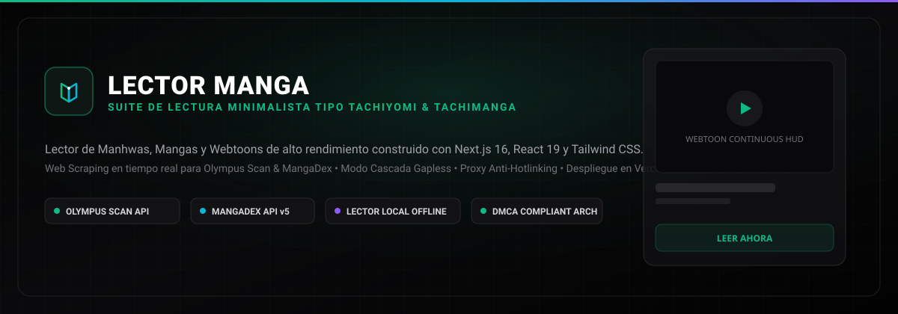

<div align="center">

  <h1>LECTOR MANGA</h1>

  <p><b>La Suite de Lectura Web & Local para Manhwas, Mangas y Webtoons</b></p>
  <p><i>Arquitectura abierta inspirada en Tachiyomi y Tachimanga. Scraping en tiempo real para Olympus Scan, integración nativa con MangaDex API v5, lector offline y proxy streaming anti-hotlink compatible con Vercel.</i></p>

  <p>
    <a href="LICENSE"></a>
    
    
    
    
    
    
  </p>

  <br/>

  

  <br/><br/>

  <sub>
    <a href="#características">Características</a> •
    <a href="#arquitectura-legal--dmca">Legal & DMCA</a> •
    <a href="#instalación">Instalación</a> •
    <a href="#despliegue-en-vercel">Despliegue Vercel</a> •
    <a href="#atajos-de-teclado">Atajos</a> •
    <a href="#comandos">Comandos</a> •
    <a href="#aviso-legal">Aviso Legal</a>
  </sub>

  <br/><br/>
</div>

---

## Características

<table>
  <tr>
    <td width="50%">
      <br/>
      <b>Scraping Dinámico para Olympus Scan</b><br/>
      Integración directa con los endpoints de Olympus Scan. Detección automática del dominio activo mediante <code>olympus.pages.dev</code>, extracción de rankings, nuevos capítulos, sinopsis completas y páginas en alta definición.
    </td>
    <td width="50%">
      <br/>
      <b>Catálogo Global MangaDex v5</b><br/>
      Acceso a millones de mangas con soporte multilingüe (Español Latino, Español España e Inglés), filtrado por popularidad y servidor de imágenes <i>@home</i> sin publicidad intrusiva.
    </td>
  </tr>
  <tr>
    <td width="50%">
      <br/>
      <b>Lector Tipo Cascada (Webtoon) Continuo</b><br/>
      Flujo vertical sin cortes (gapless) optimizado para manhwa y webtoon con cálculo dinámico por scroll e IntersectionObserver para tracking automático del progreso de lectura.
    </td>
    <td width="50%">
      <br/>
      <b>Modos Tradicionales & Doble Página</b><br/>
      Soporte para lectura clásica de manga con navegación de derecha a izquierda (RTL) u occidental (LTR), visor de doble página sincronizado y control de ajuste (ancho, alto u original).
    </td>
  </tr>
  <tr>
    <td width="50%">
      <br/>
      <b>Proxy de Streaming Anti-Hotlink</b><br/>
      Ruta de streaming HTTP dedicada (<code>/api/proxy</code>) que reenvía encabezados User-Agent y Referer específicos, eludiendo bloqueos CORS y bloqueos de dominios de imágenes en servidores remotos.
    </td>
    <td width="50%">
      <br/>
      <b>Lector de Archivos Locales 100% Offline</b><br/>
      Módulo idéntico a la fuente local de Tachiyomi. Permite arrastrar o seleccionar imágenes desde el disco local para lectura inmediata en memoria, sin conexión a Internet y con privacidad absoluta.
    </td>
  </tr>
  <tr>
    <td width="50%">
      <br/>
      <b>Biblioteca Persistente & Historial</b><br/>
      Gestión de biblioteca dividida por estados (Leyendo, Completados, Por Leer), reanudación automática en el último capítulo leído y registro cronológico de sesiones de lectura.
    </td>
    <td width="50%">
      <br/>
      <b>Compatibilidad Total con Vercel</b><br/>
      Construido sobre Next.js 16 App Router con Route Handlers serverless. Funciona tanto de forma local con Node.js como desplegado con un clic en Vercel sin límites de imágenes.
    </td>
  </tr>
</table>

---

## Arquitectura Legal & DMCA

Para garantizar que el proyecto pueda ser alojado con seguridad en **GitHub** y desplegado en plataformas como **Vercel** sin riesgo de reclamos o suspensión, Lector Manga implementa el mismo estándar legal que **Tachiyomi**, **Mihon**, **Paperback** y **Suwayomi**:

1. **Política de Cero Alojamiento (Zero-Hosting Policy)**: El repositorio y el servidor no alojan, almacenan ni distribuyen ningún archivo de manga, imagen o traducción protegida por derechos de autor.
2. **Framework de Visualización Neutral**: El software actúa como un navegador especializado o lector RSS, interpretando datos públicos a petición exclusiva del usuario.
3. **Mecanismo de Desacople**: Las fuentes son tratadas como proveedores modulares externos y no forman parte de una base de datos propietaria.
4. **Respeto a los Creadores**: Todos los derechos pertenecen a los autores, editoriales originales y equipos de scanlation.

---

## Instalación

### Prerrequisitos
- **Node.js**: v20.0.0 o superior (verificado en v26+)
- **npm** o gestor de paquetes preferido

```bash
# 1. Clonar el repositorio
git clone https://github.com/MAKIZAPA/lector-manga.git

# 2. Entrar al directorio del proyecto
cd lector-manga

# 3. Instalar las dependencias
npm install

# 4. Iniciar el servidor de desarrollo local
npm run dev

# 5. Abrir en el navegador
# -> http://localhost:3000
```

---

## Despliegue en Vercel

Lector Manga está optimizado para ejecutarse en la infraestructura serverless de **Vercel**:

### Opción 1: Mediante la CLI de Vercel
```bash
# 1. Instalar la CLI de Vercel si no la tienes
npm i -g vercel

# 2. Desplegar directamente desde el proyecto
vercel --prod
```

### Opción 2: Mediante el Panel de GitHub
1. Haz un push de este repositorio a tu cuenta de GitHub: `https://github.com/MAKIZAPA/lector-manga`.
2. En [vercel.com](https://vercel.com), selecciona **Add New Project** e importa el repositorio `lector-manga`.
3. Vercel detectará automáticamente la configuración de **Next.js**. Haz clic en **Deploy**.
4. ¡Tu lector estará disponible en producción en segundos con certificado SSL gratuito!

---

## Atajos de Teclado

| Tecla | Función |
| :---: | :--- |
| <kbd>→</kbd> / <kbd>K</kbd> | **Siguiente página** o avanzar en el scroll de lectura |
| <kbd>←</kbd> / <kbd>J</kbd> | **Página anterior** o retroceder en el scroll |
| <kbd>F</kbd> | Alternar modo **Pantalla Completa** |
| <kbd>M</kbd> | Cambiar entre modos de lectura (**Cascada / Simple / Doble**) |
| <kbd>/</kbd> o <kbd>Ctrl</kbd> + <kbd>K</kbd> | Abrir modal de **Búsqueda Instantánea** |
| <kbd>Esc</kbd> | Cerrar modales o restaurar barras de navegación (HUD) |

---

## Comandos

<details>
<summary><b>Haz clic aquí para ver todos los scripts y comandos de desarrollo</b></summary>
<br/>

| Comando | Descripción |
| :--- | :--- |
| `npm run dev` | Inicia el entorno de desarrollo local con recarga rápida en el puerto 3000 |
| `npm run build` | Compila la aplicación de forma optimizada para producción con Next.js Turbopack |
| `npm run start` | Arranca el servidor de producción compilado |
| `npm test` | Ejecuta la suite de pruebas unitarias y de integración con Vitest |
| `npm run lint` | Ejecuta el análisis estático de código con ESLint |

</details>

---

## Autor & Agradecimientos

- **Desarrollado y diseñado por:** [@makizapa](https://github.com/MAKIZAPA)
- **Inspiración arquitectónica:** Ecosistemas de código abierto [Tachiyomi](https://github.com/tachiyomiorg), [Mihon](https://github.com/mihonapp) y [Suwayomi](https://github.com/Suwayomi).

---

## Aviso Legal

<details>
<summary><b>Haz clic aquí para leer el descargo de responsabilidad legal y términos</b></summary>
<br/>

Este software se proporciona únicamente con fines educativos y de investigación sobre arquitecturas de lectura web. El desarrollador no asume ninguna responsabilidad por el uso que terceros o usuarios individuales hagan de esta herramienta ni por el contenido accesible a través de fuentes o sitios web de terceros. Todas las marcas registradas pertenecen a sus respectivos dueños.

</details>

---

## Licencia

Este proyecto está bajo la Licencia **MIT**. Consulta el archivo [LICENSE](LICENSE) para más detalles.
